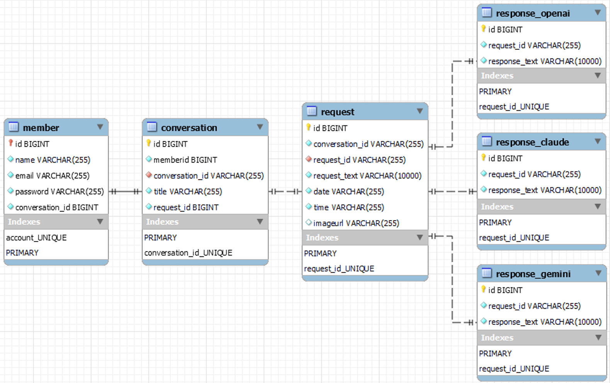
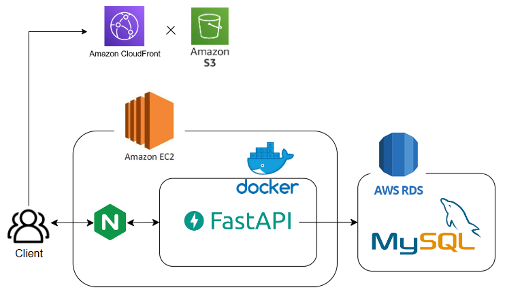

MultiAI - Your AI Conversation Hub
---
### Aim

MultiAI is a dialogue platform that integrates multiple AI chatbots, enabling users to interact with ChatGPT, Gemini, and Claude 3 simultaneously, enhancing the conversation experience while offering convenient management and retrieval functions.

### Core Function:

1. Chat Room: Chat with ChatGPT, Gemini, Claude 3 simultaneously
2. User registration and login: manage user accounts
3. History records: store conversation records for user convenience
4. Voice input: input via voice (Google Speech to Text API)
5. Picture conversation: upload pictures and have conversations

### Version of AI Models:

* OPENAI: gpt-4o-2024-05-13
* Gemini: gemini-1.5-flash
* Claude: claude-3-5-sonnet-20240620

### ERD Diagram

### Server Architecture

